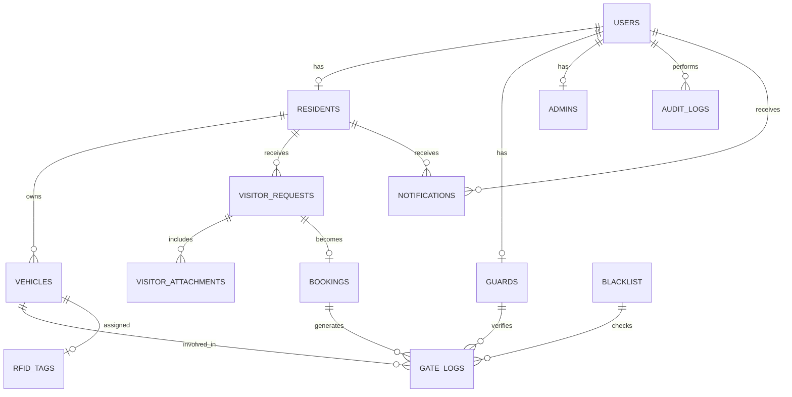

# Smart Visitor and Resident Management System

## Software Requirements Specification (SRS), Database ERD, and SQL Schema

## 1. Software Requirements Specification (SRS)

### 1.1 Introduction

This document defines the software requirements, database structure, and initial schema for a locally hosted Smart Visitor and Resident Management System for gated communities. The system will be accessible through a local area network (LAN) and will use the technologies specified in the study: PHP, JavaScript, HTML, CSS, MySQL, HTTP, MQTT, and ESP32.

The system is designed to support resident access, visitor pre-registration, resident approval, visitor verification, guard processing, and administrative monitoring. The first version focuses on web-based workflows and local hosting, with hardware integration reserved for later implementation phases.

### 1.2 Purpose

The purpose of the system is to replace manual paper-based visitor registration and improve gate security by allowing residents to pre-register visitors online, enabling guards to verify visitor records, and maintaining a searchable log of all entries and approvals.

### 1.3 Scope

The system shall provide the following major functions:

* A landing page that allows users to choose between Resident Login and Visitor Registration.
* A resident login area for authenticated homeowners.
* A visitor registration form where visitors submit personal details, vehicle details, and an uploaded government ID.
* A resident approval workflow for pending visitor requests.
* A guard dashboard for reviewing approved, pending, and expired visitor requests.
* An admin dashboard for user, resident, vehicle, and access-log management.
* A local MySQL database for storing all records.
* A web-based structure that can later communicate with ESP32-based gate hardware.

### 1.4 System Overview

The system will operate in a local network environment.

Users:

* Residents access the website from phones or computers.
* Visitors submit information through a public visitor form.
* Guards and administrators use the web system for verification and management.

Core workflow:

1. Visitor opens the landing page.
2. Visitor selects the visitor registration path.
3. Visitor fills out the form and uploads an ID image.
4. The system stores the request as pending.
5. Resident reviews and approves or rejects the request.
6. Upon approval, the system generates a booking record and QR reference.
7. Guard verifies the booking at the gate.
8. All actions are logged in the database.

### 1.5 User Classes and Characteristics

#### Resident

A homeowner or authorized household member who can log in, view requests, and approve visitors.

#### Visitor

A non-resident who submits a visit request and uploads identification details.

#### Guard

A security personnel user who verifies records, checks visitor approvals, and monitors gate activity.

#### Administrator

A system manager who maintains records, manages user accounts, and reviews logs.

#### ESP32 Device

A future hardware controller that receives gate-related commands from the backend.

### 1.6 Operating Environment

* Local server: laptop, desktop, or mini PC
* Web server: Apache
* Server-side language: PHP
* Database: MySQL
* Frontend: HTML, CSS, JavaScript
* Network: LAN or Wi-Fi router
* Future hardware integration: ESP32 via HTTP or MQTT

### 1.7 Assumptions and Dependencies

* The local server is powered on and connected to the same network as the users.
* Users access the system using a modern browser.
* Internet access is not required for core system operations.
* Uploaded ID images are stored locally or in a designated upload directory.
* Residents are pre-registered by the administrator before the system is deployed.

---

## 2. Functional Requirements

### FR-01 Landing Page

The system shall provide a landing page with two main paths:

* Resident Login
* Visitor Registration

### FR-02 Resident Authentication

The system shall allow residents to log in using registered credentials.

### FR-03 Visitor Registration

The system shall allow visitors to submit:

* Full name
* Contact number
* Vehicle type
* Plate number
* Purpose of visit
* Government ID image
* Target resident or household reference

### FR-04 Request Storage

The system shall store all visitor submissions as pending requests in the database.

### FR-05 Resident Approval

The system shall allow residents to approve or reject pending visitor requests.

### FR-06 Booking Generation

The system shall generate a booking reference for approved visitors.

### FR-07 Visitor Status Tracking

The system shall display request status as:

* Pending
* Approved
* Rejected
* Expired
* Cancelled

### FR-08 Guard Verification

The system shall allow guards to search and verify visitor requests.

### FR-09 Logging

The system shall record all significant actions in an audit log.

### FR-10 Admin Management

The system shall allow administrators to manage users, residents, bookings, and logs.

---

## 3. Non-Functional Requirements

### NFR-01 Performance

The system shall load pages and process requests within acceptable local network response time.

### NFR-02 Reliability

The system shall remain operational without internet connectivity as long as the local server is running.

### NFR-03 Security

The system shall use password hashing, session handling, and role-based access control.

### NFR-04 Usability

The interface shall be simple enough for residents, guards, and visitors to use without extensive training.

### NFR-05 Maintainability

The system shall be structured into reusable modules and clearly named files.

### NFR-06 Scalability

The database and application shall support future expansion to include gate hardware and license plate recognition.

---

## 4. External Interface Requirements

### 4.1 User Interface

The user interface shall include:

* Landing page
* Resident login page
* Visitor registration page
* Resident dashboard
* Guard dashboard
* Admin dashboard
* Approval and request list pages

### 4.2 Hardware Interface

The backend shall later communicate with ESP32 hardware using:

* HTTP requests
* MQTT messages

### 4.3 Software Interface

The backend shall connect to:

* MySQL database
* PHP server
* JavaScript-based frontend

---

## 5. System Use Cases

### Use Case 1: Visitor Registers a Visit

Actor: Visitor
Precondition: Visitor can access the landing page
Main Flow:

1. Visitor selects Visitor Registration.
2. Visitor fills out the form.
3. Visitor uploads a government ID image.
4. System saves the request as pending.
5. Resident receives a notification or sees the request in the dashboard.

### Use Case 2: Resident Approves Visitor

Actor: Resident
Precondition: Visitor request exists and is pending
Main Flow:

1. Resident logs in.
2. Resident opens pending requests.
3. Resident reviews visitor details.
4. Resident approves or rejects the request.
5. System updates the request status.

### Use Case 3: Guard Verifies Visitor

Actor: Guard
Precondition: Visitor request is approved
Main Flow:

1. Guard logs in.
2. Guard searches visitor record.
3. Guard confirms booking details.
4. Guard marks visitor as processed.
5. System stores the verification log.

### Use Case 4: Administrator Manages Accounts

Actor: Administrator
Precondition: Administrator is authenticated
Main Flow:

1. Admin logs in.
2. Admin opens management dashboard.
3. Admin adds, edits, or deactivates records.
4. System updates the database.
5. System records the action in audit logs.

---

## 6. Database ERD



### ERD Notes

* `users` stores login credentials and role type.
* `residents`, `guards`, and `admins` are profile extensions of `users`.
* `visitor_requests` stores the visitor submission and approval flow.
* `bookings` stores approved visitor passes.
* `vehicles` stores resident vehicle data.
* `rfid_tags` stores future RFID assignments.
* `gate_logs` stores all gate transactions.
* `audit_logs` stores system actions.
* `blacklist` stores blocked persons or vehicles.
* `visitor_attachments` stores uploaded ID images and other supporting files.

---

## 7. SQL Schema

```sql
CREATE DATABASE IF NOT EXISTS smart_gate
  CHARACTER SET utf8mb4
  COLLATE utf8mb4_unicode_ci;

USE smart_gate;

-- 1. USERS
CREATE TABLE users (
    id BIGINT UNSIGNED AUTO_INCREMENT PRIMARY KEY,
    full_name VARCHAR(150) NOT NULL,
    email VARCHAR(150) NOT NULL UNIQUE,
    password VARCHAR(255) NOT NULL,
    role ENUM('resident', 'guard', 'admin') NOT NULL,
    status ENUM('active', 'inactive', 'suspended') NOT NULL DEFAULT 'active',
    last_login_at DATETIME NULL,
    created_at TIMESTAMP DEFAULT CURRENT_TIMESTAMP,
    updated_at TIMESTAMP DEFAULT CURRENT_TIMESTAMP ON UPDATE CURRENT_TIMESTAMP
) ENGINE=InnoDB;

-- 2. RESIDENTS
CREATE TABLE residents (
    id BIGINT UNSIGNED AUTO_INCREMENT PRIMARY KEY,
    user_id BIGINT UNSIGNED NOT NULL UNIQUE,
    house_number VARCHAR(50) NOT NULL,
    block_number VARCHAR(50) NULL,
    contact_number VARCHAR(30) NULL,
    emergency_contact VARCHAR(30) NULL,
    status ENUM('active', 'inactive') NOT NULL DEFAULT 'active',
    created_at TIMESTAMP DEFAULT CURRENT_TIMESTAMP,
    updated_at TIMESTAMP DEFAULT CURRENT_TIMESTAMP ON UPDATE CURRENT_TIMESTAMP,
    CONSTRAINT fk_residents_user
        FOREIGN KEY (user_id) REFERENCES users(id)
        ON DELETE CASCADE
) ENGINE=InnoDB;

-- 3. GUARDS
CREATE TABLE guards (
    id BIGINT UNSIGNED AUTO_INCREMENT PRIMARY KEY,
    user_id BIGINT UNSIGNED NOT NULL UNIQUE,
    guard_code VARCHAR(50) NULL,
    shift_name VARCHAR(50) NULL,
    contact_number VARCHAR(30) NULL,
    status ENUM('active', 'inactive') NOT NULL DEFAULT 'active',
    created_at TIMESTAMP DEFAULT CURRENT_TIMESTAMP,
    updated_at TIMESTAMP DEFAULT CURRENT_TIMESTAMP ON UPDATE CURRENT_TIMESTAMP,
    CONSTRAINT fk_guards_user
        FOREIGN KEY (user_id) REFERENCES users(id)
        ON DELETE CASCADE
) ENGINE=InnoDB;

-- 4. ADMINS
CREATE TABLE admins (
    id BIGINT UNSIGNED AUTO_INCREMENT PRIMARY KEY,
    user_id BIGINT UNSIGNED NOT NULL UNIQUE,
    admin_code VARCHAR(50) NULL,
    status ENUM('active', 'inactive') NOT NULL DEFAULT 'active',
    created_at TIMESTAMP DEFAULT CURRENT_TIMESTAMP,
    updated_at TIMESTAMP DEFAULT CURRENT_TIMESTAMP ON UPDATE CURRENT_TIMESTAMP,
    CONSTRAINT fk_admins_user
        FOREIGN KEY (user_id) REFERENCES users(id)
        ON DELETE CASCADE
) ENGINE=InnoDB;

-- 5. VEHICLES
CREATE TABLE vehicles (
    id BIGINT UNSIGNED AUTO_INCREMENT PRIMARY KEY,
    resident_id BIGINT UNSIGNED NOT NULL,
    plate_number VARCHAR(30) NOT NULL,
    vehicle_type ENUM('car', 'motorcycle', 'truck', 'other') NOT NULL,
    brand VARCHAR(100) NULL,
    model VARCHAR(100) NULL,
    color VARCHAR(50) NULL,
    status ENUM('active', 'inactive') NOT NULL DEFAULT 'active',
    created_at TIMESTAMP DEFAULT CURRENT_TIMESTAMP,
    updated_at TIMESTAMP DEFAULT CURRENT_TIMESTAMP ON UPDATE CURRENT_TIMESTAMP,
    UNIQUE KEY uniq_plate_number (plate_number),
    CONSTRAINT fk_vehicles_resident
        FOREIGN KEY (resident_id) REFERENCES residents(id)
        ON DELETE CASCADE
) ENGINE=InnoDB;

-- 6. RFID TAGS
CREATE TABLE rfid_tags (
    id BIGINT UNSIGNED AUTO_INCREMENT PRIMARY KEY,
    vehicle_id BIGINT UNSIGNED NOT NULL UNIQUE,
    uid VARCHAR(100) NOT NULL UNIQUE,
    tag_type ENUM('windshield', 'card', 'fob', 'other') NOT NULL DEFAULT 'windshield',
    issued_at DATETIME NULL,
    status ENUM('active', 'inactive', 'lost', 'revoked') NOT NULL DEFAULT 'active',
    created_at TIMESTAMP DEFAULT CURRENT_TIMESTAMP,
    updated_at TIMESTAMP DEFAULT CURRENT_TIMESTAMP ON UPDATE CURRENT_TIMESTAMP,
    CONSTRAINT fk_rfid_vehicle
        FOREIGN KEY (vehicle_id) REFERENCES vehicles(id)
        ON DELETE CASCADE
) ENGINE=InnoDB;

-- 7. VISITOR REQUESTS
CREATE TABLE visitor_requests (
    id BIGINT UNSIGNED AUTO_INCREMENT PRIMARY KEY,
    resident_id BIGINT UNSIGNED NOT NULL,
    visitor_name VARCHAR(150) NOT NULL,
    contact_number VARCHAR(30) NULL,
    plate_number VARCHAR(30) NULL,
    vehicle_type ENUM('car', 'motorcycle', 'truck', 'other') NOT NULL DEFAULT 'other',
    purpose_of_visit VARCHAR(255) NOT NULL,
    government_id_type VARCHAR(100) NULL,
    government_id_number VARCHAR(100) NULL,
    status ENUM('pending', 'approved', 'rejected', 'expired', 'cancelled') NOT NULL DEFAULT 'pending',
    requested_visit_date DATE NULL,
    requested_arrival_time TIME NULL,
    requested_departure_time TIME NULL,
    approved_by BIGINT UNSIGNED NULL,
    approved_at DATETIME NULL,
    rejected_by BIGINT UNSIGNED NULL,
    rejected_at DATETIME NULL,
    rejection_reason VARCHAR(255) NULL,
    qr_reference VARCHAR(120) NULL UNIQUE,
    created_at TIMESTAMP DEFAULT CURRENT_TIMESTAMP,
    updated_at TIMESTAMP DEFAULT CURRENT_TIMESTAMP ON UPDATE CURRENT_TIMESTAMP,
    CONSTRAINT fk_visitor_requests_resident
        FOREIGN KEY (resident_id) REFERENCES residents(id)
        ON DELETE CASCADE,
    CONSTRAINT fk_visitor_requests_approved_by
        FOREIGN KEY (approved_by) REFERENCES users(id)
        ON DELETE SET NULL,
    CONSTRAINT fk_visitor_requests_rejected_by
        FOREIGN KEY (rejected_by) REFERENCES users(id)
        ON DELETE SET NULL
) ENGINE=InnoDB;

-- 8. VISITOR ATTACHMENTS
CREATE TABLE visitor_attachments (
    id BIGINT UNSIGNED AUTO_INCREMENT PRIMARY KEY,
    visitor_request_id BIGINT UNSIGNED NOT NULL,
    file_type ENUM('government_id', 'other') NOT NULL DEFAULT 'government_id',
    file_path VARCHAR(255) NOT NULL,
    original_filename VARCHAR(255) NULL,
    mime_type VARCHAR(100) NULL,
    file_size BIGINT UNSIGNED NULL,
    created_at TIMESTAMP DEFAULT CURRENT_TIMESTAMP,
    updated_at TIMESTAMP DEFAULT CURRENT_TIMESTAMP ON UPDATE CURRENT_TIMESTAMP,
    CONSTRAINT fk_attachments_request
        FOREIGN KEY (visitor_request_id) REFERENCES visitor_requests(id)
        ON DELETE CASCADE
) ENGINE=InnoDB;

-- 9. BOOKINGS
CREATE TABLE bookings (
    id BIGINT UNSIGNED AUTO_INCREMENT PRIMARY KEY,
    visitor_request_id BIGINT UNSIGNED NOT NULL UNIQUE,
    booking_code VARCHAR(100) NOT NULL UNIQUE,
    qr_code_text VARCHAR(255) NOT NULL UNIQUE,
    status ENUM('active', 'used', 'expired', 'cancelled') NOT NULL DEFAULT 'active',
    check_in_at DATETIME NULL,
    check_out_at DATETIME NULL,
    created_at TIMESTAMP DEFAULT CURRENT_TIMESTAMP,
    updated_at TIMESTAMP DEFAULT CURRENT_TIMESTAMP ON UPDATE CURRENT_TIMESTAMP,
    CONSTRAINT fk_bookings_request
        FOREIGN KEY (visitor_request_id) REFERENCES visitor_requests(id)
        ON DELETE CASCADE
) ENGINE=InnoDB;

-- 10. GATE LOGS
CREATE TABLE gate_logs (
    id BIGINT UNSIGNED AUTO_INCREMENT PRIMARY KEY,
    booking_id BIGINT UNSIGNED NULL,
    resident_id BIGINT UNSIGNED NULL,
    guard_id BIGINT UNSIGNED NULL,
    vehicle_id BIGINT UNSIGNED NULL,
    event_type ENUM('entry', 'exit', 'manual_open', 'qr_scan', 'rfid_scan', 'walk_in') NOT NULL,
    person_name VARCHAR(150) NULL,
    plate_number VARCHAR(30) NULL,
    qr_reference VARCHAR(120) NULL,
    rfid_uid VARCHAR(100) NULL,
    gate_status ENUM('approved', 'denied', 'pending', 'manual_override') NOT NULL DEFAULT 'pending',
    log_notes VARCHAR(255) NULL,
    captured_image_path VARCHAR(255) NULL,
    created_at TIMESTAMP DEFAULT CURRENT_TIMESTAMP,
    updated_at TIMESTAMP DEFAULT CURRENT_TIMESTAMP ON UPDATE CURRENT_TIMESTAMP,
    CONSTRAINT fk_gate_logs_booking
        FOREIGN KEY (booking_id) REFERENCES bookings(id)
        ON DELETE SET NULL,
    CONSTRAINT fk_gate_logs_resident
        FOREIGN KEY (resident_id) REFERENCES residents(id)
        ON DELETE SET NULL,
    CONSTRAINT fk_gate_logs_guard
        FOREIGN KEY (guard_id) REFERENCES guards(id)
        ON DELETE SET NULL,
    CONSTRAINT fk_gate_logs_vehicle
        FOREIGN KEY (vehicle_id) REFERENCES vehicles(id)
        ON DELETE SET NULL
) ENGINE=InnoDB;

-- 11. NOTIFICATIONS
CREATE TABLE notifications (
    id BIGINT UNSIGNED AUTO_INCREMENT PRIMARY KEY,
    user_id BIGINT UNSIGNED NOT NULL,
    title VARCHAR(150) NOT NULL,
    message TEXT NOT NULL,
    is_read TINYINT(1) NOT NULL DEFAULT 0,
    reference_type VARCHAR(50) NULL,
    reference_id BIGINT UNSIGNED NULL,
    created_at TIMESTAMP DEFAULT CURRENT_TIMESTAMP,
    updated_at TIMESTAMP DEFAULT CURRENT_TIMESTAMP ON UPDATE CURRENT_TIMESTAMP,
    CONSTRAINT fk_notifications_user
        FOREIGN KEY (user_id) REFERENCES users(id)
        ON DELETE CASCADE
) ENGINE=InnoDB;

-- 12. AUDIT LOGS
CREATE TABLE audit_logs (
    id BIGINT UNSIGNED AUTO_INCREMENT PRIMARY KEY,
    user_id BIGINT UNSIGNED NULL,
    action VARCHAR(150) NOT NULL,
    module_name VARCHAR(100) NULL,
    details TEXT NULL,
    ip_address VARCHAR(45) NULL,
    user_agent VARCHAR(255) NULL,
    created_at TIMESTAMP DEFAULT CURRENT_TIMESTAMP,
    updated_at TIMESTAMP DEFAULT CURRENT_TIMESTAMP ON UPDATE CURRENT_TIMESTAMP,
    CONSTRAINT fk_audit_logs_user
        FOREIGN KEY (user_id) REFERENCES users(id)
        ON DELETE SET NULL
) ENGINE=InnoDB;

-- 13. BLACKLIST
CREATE TABLE blacklist (
    id BIGINT UNSIGNED AUTO_INCREMENT PRIMARY KEY,
    resident_id BIGINT UNSIGNED NULL,
    visitor_name VARCHAR(150) NULL,
    plate_number VARCHAR(30) NULL,
    reason VARCHAR(255) NOT NULL,
    status ENUM('active', 'inactive') NOT NULL DEFAULT 'active',
    start_date DATE NULL,
    end_date DATE NULL,
    created_by BIGINT UNSIGNED NULL,
    created_at TIMESTAMP DEFAULT CURRENT_TIMESTAMP,
    updated_at TIMESTAMP DEFAULT CURRENT_TIMESTAMP ON UPDATE CURRENT_TIMESTAMP,
    CONSTRAINT fk_blacklist_resident
        FOREIGN KEY (resident_id) REFERENCES residents(id)
        ON DELETE SET NULL,
    CONSTRAINT fk_blacklist_created_by
        FOREIGN KEY (created_by) REFERENCES users(id)
        ON DELETE SET NULL
) ENGINE=InnoDB;

-- INDEXES FOR COMMON LOOKUPS
CREATE INDEX idx_visitors_status ON visitor_requests(status);
CREATE INDEX idx_visitors_resident ON visitor_requests(resident_id);
CREATE INDEX idx_gate_logs_created_at ON gate_logs(created_at);
CREATE INDEX idx_gate_logs_plate ON gate_logs(plate_number);
CREATE INDEX idx_blacklist_plate ON blacklist(plate_number);
CREATE INDEX idx_notifications_is_read ON notifications(is_read);
```

---

## 8. Recommended Initial Seed Data

The following records are recommended for testing after schema creation:

* 1 administrator account
* 1 guard account
* 1 resident account
* 1 sample resident profile
* 1 sample vehicle
* 1 sample visitor request
* 1 sample booking record
* 1 sample notification

---

## 9. Notes for Implementation

### Landing Page Behavior

* The landing page shall present two buttons:

  * Resident Login
  * Visitor Registration

### Visitor Workflow

* Visitors shall not need to create an account.
* Visitors shall fill out a form and upload a valid ID image.
* The system shall save the request as pending until approved by the resident.

### Approval Workflow

* Approved visitor requests shall generate a booking code and QR reference.
* The QR reference shall later be used by the guard for verification.

### Local Hosting

* The entire system shall run on a local server.
* Users on the same network shall access the site using the server’s local IP address.

---


